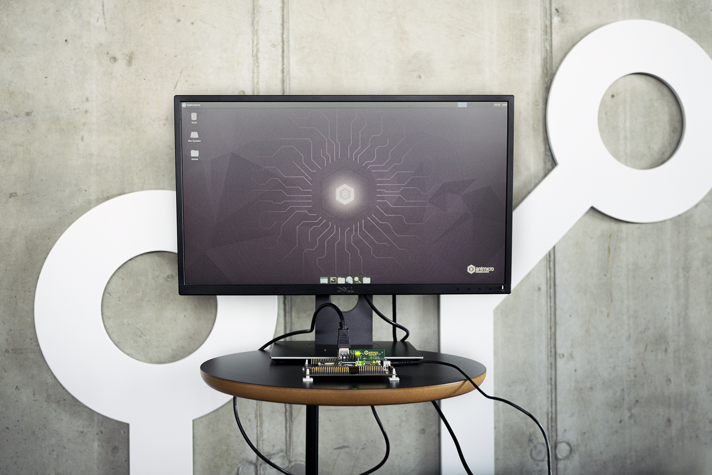

HDMI on Snickerdoodle
=====================

Copyright (c) 2020-2021 [Antmicro](https://www.antmicro.com)

This is an example design for the open hardware [Snickerdoodle HDMI breakout board](https://github.com/antmicro/snickerdoodle-hdmi-breakout).
The design utilizes the following IP cores:

- [FastVDMA](https://github.com/antmicro/fastvdma-verilog-axi-in-axis-out)
- [HDMI Transmitter](https://github.com/antmicro/hdmi-transmitter-ip)
- [AXI Display Controller](https://github.com/antmicro/axi-display-controller)
- [LiteX Mixed-mode Clock Manager](https://github.com/antmicro/mmcm-drp)

This setup is designed to work with a Linux system with a `/dev/fb0` framebuffer device that outputs its contents via the HDMI connector of the breakout board.



Building the FPGA design
========================

1. Setup the Vivado environment:

    ```
    source /path/to/Vivado/2018.3/settings64.sh
    ```

1. Use [FuseSoC](https://github.com/olofk/fusesoc) to build the bitstream:

    ```
    fusesoc --cores-root cores --cores-root src run snickerdoodle_hdmi
    ```
    FuseSoC will try to program the FPGA. Note that if the device is not connected properly, the command will fail.

    The bitstream will be stored here:
    ```
    build/snickerdoodle_hdmi_0/default-vivado/snickerdoodle_hdmi_0.bit
    ```

1. Generate the FSBL from Vivado design

Building the software
=====================

1. Clone and build the U-Boot bootloader:

   ```
   git clone https://github.com/krtkl/snickerdoodle-u-boot.git
   pushd snickerdoodle-u-boot
   make snickerdoodle_black_defconfig
   make CROSS_COMPILE=arm-linux-gnueabihf-
   ln -s u-boot u-boot.elf
   popd
   ```

   The resulting `u-boot.elf` file will be located in the `snickerdoodle-u-boot` directory.

1. Clone and build the Linux kernel:

   ```
   git clone https://github.com/antmicro/linux-xlnx.git -b axi_dispctrl
   pushd linux-xlnx
   make ARCH=arm CROSS_COMPILE=arm-linux-gnueabihf- LOADADDR=0x8000 snickerdoodle_defconfig
   make ARCH=arm CROSS_COMPILE=arm-linux-gnueabihf- LOADADDR=0x8000 -j$(nproc)
   make ARCH=arm CROSS_COMPILE=arm-linux-gnueabihf- LOADADDR=0x8000 uImage
   popd
   ```

   The resulting `uImage` file will be located in the `linux-xlnx/arch/arm/boot/` directory.

1. Clone devicetree repository and build the dtb file:

   ```
   git clone https://github.com/antmicro/snickerdoodle-dts.git -b hdmi-support
   pushd snickerdoodle-dts
   make
   popd
   ```

   The resulting `snickerdoodle-black.dtb` file will be located in the `snickerdoodle-dts` directory.

1. Create a `boot.bif` file with the following contents:


    ```
    the_ROM_image:
    {
        [bootloader]/path/to/fsbl.elf
        /path/to/snickerdoodle_hdmi_0.bit
        /path/to/u-boot.elf
    }
    ```

1. Generate a `boot.bin` file (You can use the [mkbootimage](https://github.com/antmicro/zynq-mkbootimage) tool or Xilinx SDK):

    To generate the `boot.bin` file with `mkbootimage` run:
    ```
    mkbootimage boot.bif boot.bin
    ```

Once all the binaries are ready, prepare an SD card following the [official guide](https://github.com/krtkl/snickerdoodle-manual/blob/master/snickerdoodle-SDCard/snickerdoodle-SDCard.pdf) and replace the Linux kernel, devicetree and `boot.bin` files with the ones generated in the steps above.
Insert the SD card to the snickerdoodle board and boot the system.

Running Linux Desktop Environment
=================================

1. Power up the board and connect to the serial console

1. Attach an HDMI display to the board (by default it should show a black screen at 1080P60 resolution)

1. Log in an check if the wireless connection is up with `ip a`

1. Install required packages on the device:

    ```
    sudo apt update
    sudo apt install xfce4 x11vnc
    ```

1. Create the `/usr/share/X11/xorg.conf.d/10-fbdev.conf` file with the following contents:

    ```
    Section "Device"
            Identifier "axi_dispctrl FB"
            Driver "fbdev"
            Option "fbdev" "/dev/fb0"
    EndSection
    ```

1. Start XFCE:

    ```
    sudo rm /dev/dri/card0
    sudo startxfce4
    ```

   You should now see an XFCE session on the HDMI output.

1. Snickerdoodle and breakyBreaky have no USB Host ports which could be used to connect keyboard and mouse.
   A VNC server can be used to forward HID devices from a PC to the device.
   To do it connect to the board using SSH and start a VNC server with:

    ```
    x11vnc -display :0
    ```

   Once the server is running you can connect to it using any VNC client.
